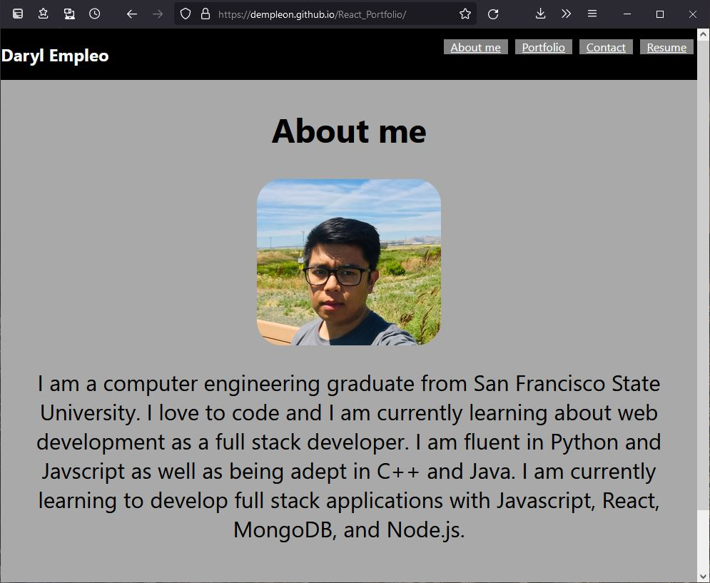
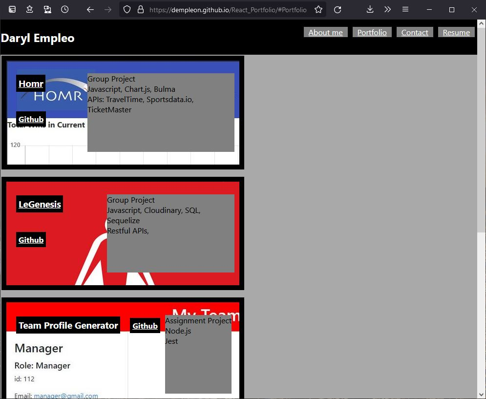
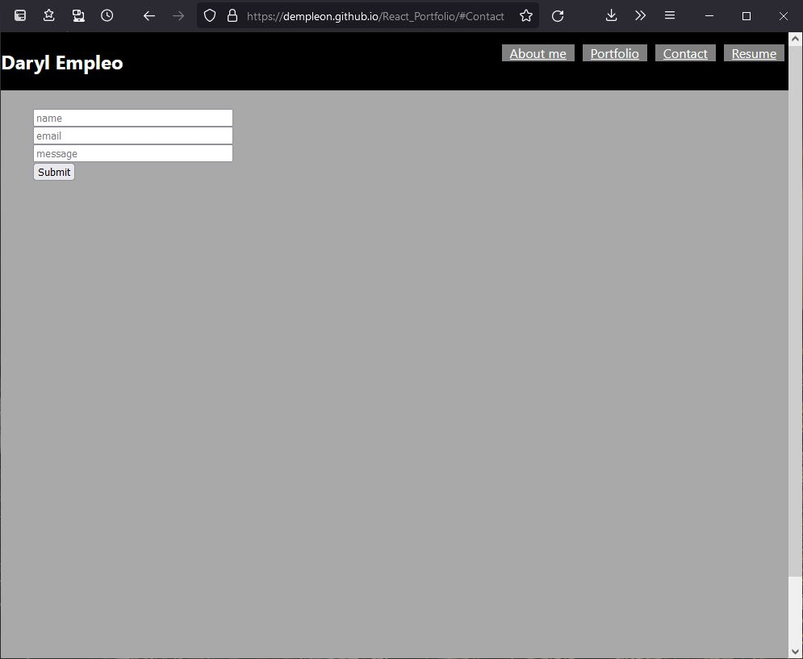
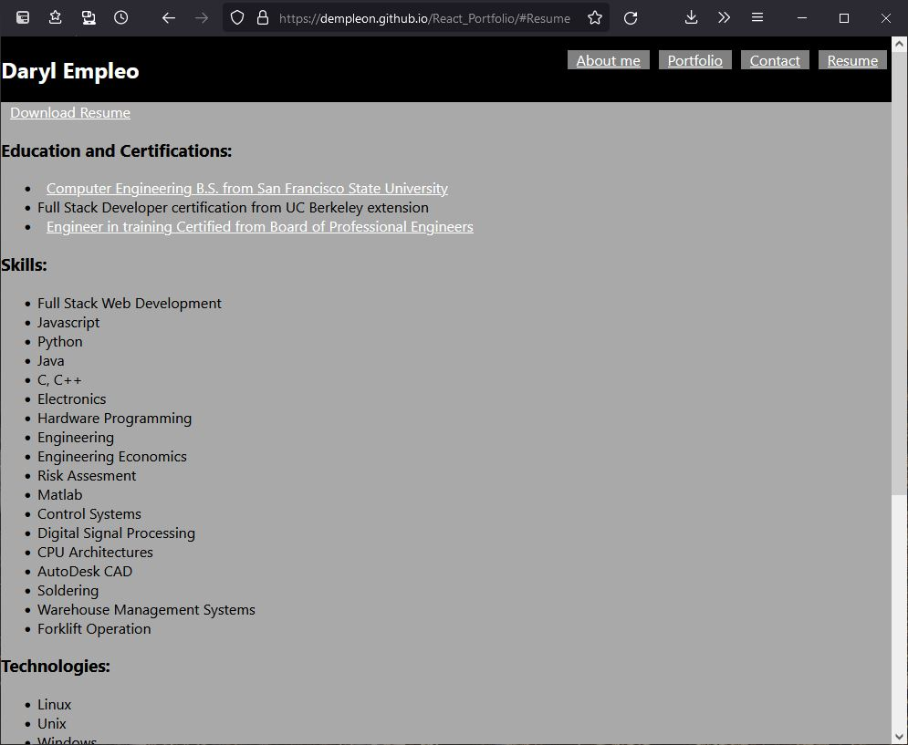

# React-Portfolio

## Description  
A personal website written with react. Contains an about me page, portfolio projects page, contact, and resume page. The app is deployed with github pages. It is a work in progress.
 
[Deployed_Link](https://dempleon.github.io/React_Portfolio/)
 

## Table of Contents
[License](#React-Portfolio) 
[Questions](#Questions) 
    

## Questions
If you have any questions about the repo, or you would like to contact me about my work please email me at [Dempoleon@gmail.com](Dempoleon@gmail.com).
You can find more of my work at [Dempleon](https://github.com/Dempleon)

